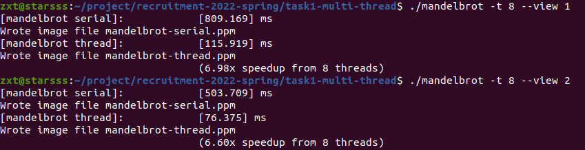
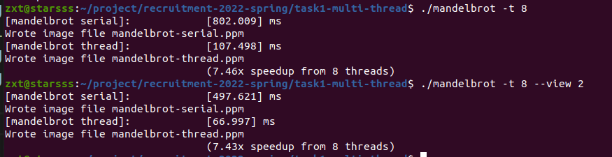
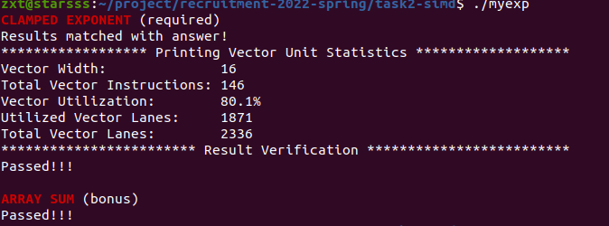

CPU：11th Gen intel Core i7-11800H @2.30Ghz 八核
内存：英睿达 DDR4 3200MHz 8G x2

# task1
首先从给出的WIKI百科查看mandelbrot集合到底是什么，然后也可以看到相关的计算机计算程序。这个程序利用了mandelbrot集合的一个性质，模大于2就不属于集合。并且程序认为，迭代次数达到设定的值后，就认为这个点属于mandelbrot集合，所以计算出来的集合并不是完全准确的。
接下来先浏览一遍main函数和另外两个cpp文件，mandelbrotSerial是线性计算的。amndelbrotThread里面调用线性的mandelbrotSerial函数来计算。然后计算加速比之类的东西都写好了，所以只用写workerThreadStart这个函数。
最开始先尝试了一下两个线程，一个线程算上半部分，一个线程算下半部分，试了一下手。然后按照同样的思路，把整个区域从上到下划分为8块，用8个线程来计算。但是发现加速比并不太理想。看了一下提示，把计时函数copy过来，同时打印出每个线程的运行时间，看看问题在哪。
观察每个线程的运行时间，发现从实轴附近的点到图像的上下延伸，计算的代价是在下降的。自然而然的，有第一个想法。
idea1：按照大概的每个区域的计算代价，不平均的划分像素点，从而使每个线程的计算时间达到差不多。然后后面就是调参数了。在第一版的commit里面就是这个想法。但是这么做问题还比较大，一是代码量大，写出来耗时，二是这种优化相当于是从结果倒推计算过程，不利于扩展。这种写法，把参数调的不错之后差不多可以达到六倍多吧。

idea2:然后后来想到这玩意不是跟cache的划分里面讲的有相似么，我整个分大块，与此对应的还有分小块。height是1200个像素，把i+8*j行的像素分给线程i,然后代码也比较好写，跑一下还能变得更快一点。

# task2
task2应该就是用来熟悉向量操作的。一个是把指数计算向量化，一个是把数组求和向量化。比较麻烦的点在于找要用的函数，写好掩码。函数比较难打，前缀都是一样的，有点削弱了代码提示的作用。
指数计算向量化的瓶颈在于那一组向量里面指数最大的一个。
数组求和，只是在vector的宽度里面把O(n)的操作变成了O(lgn)，但是实际上还是线性的处理了(n/vectorwidth)+1个元素。感觉可以每次操作后把两个vectorwidth向量里面的前一半合到一个向量里面，但是看起来这么写好麻烦的样子。

# task3
task3doc文件夹里面也包含了一个log，记录当时整个过程。

主要看提供的三个文档，循环展开和局部变量那个来自CSAPP（CSAPP去年看得，时间有点久了，不过循环展开和尽量使用局部变量还是记忆很深刻的），然后看了一些介绍intel 向量指令集的文档（在搜索引擎搜索的了一些相关的，主要是介绍intel向量指令是啥呀，然后大概分为哪几类函数。不过一般都是什么SSE哪几年出来的之类的东西。最主要还是官方文档靠谱呀，还是得在上面找到底需要什么函数。）

1. 尽量使用局部变量
   
对于前三个有用，第四个用处不大，说明瓶颈不在这里。

1. 单纯变为多线程

就是看了一下openMP学了一下，因为这里操作比较简单，实际上只用使用一条指令，#pragma omp parallel for，锁之类的东西用不到。
note：要注意编译选项要多加一个-fopenmp

3. 然后把前两个操作合起来

从这开始每次测次数多一点，这个地方测试的时候，看资源管理器，因为CPU温度，中途会自动降低线程使用率降温。

4. 尝试了一下线程变为动态分配

#pragma omp parallel for schedule(dynamic)
发现效果还比不上静态分配

5. 看了一下发现用的vector，改成int数组

跑进10e6数量级了。

6. 先琢磨一下向量操作怎么搞
麻烦的地方在于查文档，对应想要的操作不知道它起的什么名字。
_mm_mullo_epi32乘法 SSE4.1
_mm_set1_epi32 (int a) 加载一个数 SSE2
_mm_stream_load_si128 加载一串数字 #include <smmintrin.h> SSE4.1
_mm_add_epi32 加法 SSE2
_mm_store_si128 存回去 #include <emmintrin.h> SSE2

要注意三点：1.想要用的操作的函数名称 2.包含什么头文件 3.编译选项，使用的SSE2和SSE4.1要加上-msse4 -msse2

向量操作加速效果还可以

7. 把前面的操作加起来

能跑到二十多倍吧大概

8. 然后再把Cache BLocking加上

这个玩意最开始有点难理解，想了个办法，就是把cache blocking和不优化写法，两种里面访问元素的顺序打印出来观察。发现方法本质上就是尽量把现在已经存在cache里面的所有的能算的东西都算完。
到这一步，最开始要80+秒，现在大概2+s

9. 最后整个循环展开，展开个四次康康

对运算速度的数量级没啥影响了。最后好点就是六七十倍，差点就是十几二十倍。

## 没优化前：

Running, dataset: size 256
time spent: 101861us
Passed, dataset: size 256

Running, dataset: size 512
time spent: 838538us
Passed, dataset: size 512

Running, dataset: size 1024
time spent: 8.92136e+06us
Passed, dataset: size 1024

Running, dataset: size 2048
time spent: 8.56297e+07us
Passed, dataset: size 2048

## final：

Running, dataset: size 256
time spent: 5856us
time spent: 5882us
time spent: 5969us
time spent: 4596us
time spent: 6196us
Passed, dataset: size 256

Running, dataset: size 512
time spent: 22777us
time spent: 29788us
time spent: 26068us
time spent: 23968us
time spent: 26827us
Passed, dataset: size 512

Running, dataset: size 1024
time spent: 176020us
time spent: 183459us
time spent: 182175us
time spent: 182482us
time spent: 193425us
Passed, dataset: size 1024

Running, dataset: size 2048
time spent: 1.50017e+06us
time spent: 1.51314e+06us
time spent: 1.50663e+06us
time spent: 1.53743e+06us
time spent: 1.50185e+06us
Passed, dataset: size 2048

## ps

还好晚上又闲的没事又跑一遍，之前copy了一个task3的文件夹在里面写代码的，然后后面只粘贴了代码到task3，另一个文件夹删掉了。今晚一跑居然原task3文件夹里面数据都还没下载，还好又看了一眼。糗大了。

又跑了一遍，算个准确的加速比吧

./gemm

Running, dataset: size 256
time spent: 57942us
Passed, dataset: size 256

Running, dataset: size 512
time spent: 478401us
Passed, dataset: size 512

Running, dataset: size 1024
time spent: 4.81222e+06us
Passed, dataset: size 1024

Running, dataset: size 2048
time spent: 1.06844e+08us
Passed, dataset: size 2048

./gemm

Running, dataset: size 256
time spent: 5741us
time spent: 5780us
time spent: 5333us
time spent: 7672us
time spent: 8068us
Passed, dataset: size 256

Running, dataset: size 512
time spent: 24954us
time spent: 25883us
time spent: 24738us
time spent: 24971us
time spent: 25164us
Passed, dataset: size 512

Running, dataset: size 1024
time spent: 196962us
time spent: 196731us
time spent: 192210us
time spent: 202893us
time spent: 196623us
Passed, dataset: size 1024

Running, dataset: size 2048
time spent: 1.63789e+06us
time spent: 1.61423e+06us
time spent: 1.63534e+06us
time spent: 1.6136e+06us
time spent: 1.6261e+06us
Passed, dataset: size 2048

256：10X

512：19X

1024：24X

2048：66.18X
